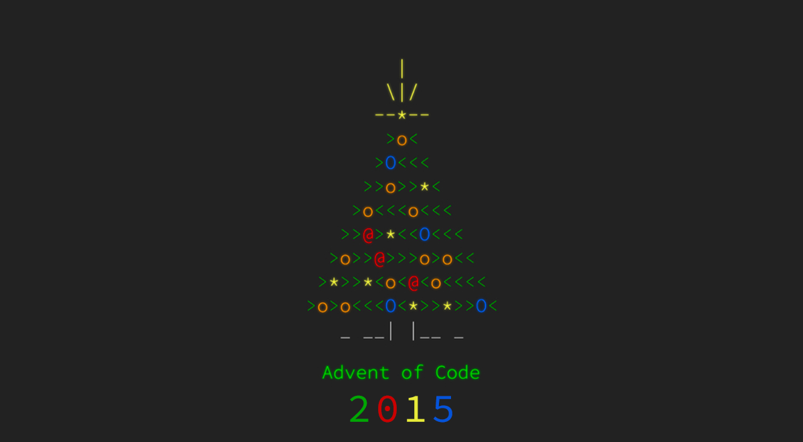

# 🎄 Advent of Code 2015 🎁

| Assignment | Data | Solution R | Solution Python | Solution C++ | Part 1 | Part 2 |
|-------|---|---|---|---|:-:|:-:|
| [Day 1: Not Quite Lisp](https://adventofcode.com/2015/day/1) | [Data](data/day01.txt) | [R - D1](solutionsR/day01.R) | [Python - D1](solutionsPython/day01.py) |   | ⭐ | ⭐ |
| [Day 2: I Was Told There Would Be No Math](https://adventofcode.com/2015/day/2) | [Data](data/day02.txt) | [R - D2](solutionsR/day02.R) | [Python - D2](solutionsPython/day02.py) |   | ⭐ | ⭐ |
| [Day 3: Perfectly Spherical Houses in a Vacuum](https://adventofcode.com/2015/day/3) | [Data](data/day03.txt) | [R - D3](solutionsR/day03.R)  | [Python - D3](solutionsPython/day03.py) |   | ⭐ | ⭐ |
| [Day 4: The Ideal Stocking Stuffer](https://adventofcode.com/2015/day/4) | [Data](data/day04.txt) | [R - D4](solutionsR/day04.R)  |   |   | ⭐ | ⭐ |
| [Day 5: Doesn't He Have Intern-Elves For This?](https://adventofcode.com/2015/day/5) | [Data](data/day05.txt) | [R - D5](solutionsR/day05.R) |   |   | ⭐ | ⭐ |
| [Day 6: Probably a Fire Hazard](https://adventofcode.com/2015/day/6) | [Data](data/day06.txt) | [R - D6](solutionsR/day06.R) |   |   | ⭐ | ⭐ |
| [Day 7: Some Assembly Required](https://adventofcode.com/2015/day/7) | [Data](data/day07.txt) | [R - D7](solutionsR/day07.R) |   |   |   |   |
| [Day 8: Matchsticks](https://adventofcode.com/2015/day/8) | [Data](data/day08.txt) | [R - D8](solutionsR/day08.R) |   |   |   |   |
| [Day 9: All in a Single Night](https://adventofcode.com/2015/day/9) | [Data](data/day09.txt) | [R - D9](solutionsR/day09.R) |   |   |   |   |
| [Day 10: Elves Look, Elves Say](https://adventofcode.com/2015/day/10) | [Data](data/day10.txt) | [R - D10](solutionsR/day10.R) |   |   |   |   |
| [Day 11: Corporate Policy](https://adventofcode.com/2015/day/11) | [Data](data/day11.txt) | [R - D11](solutionsR/day11.R) |   |   |   |   |
| [Day 12: JSAbacusFramework.io](https://adventofcode.com/2015/day/12) | [Data](data/day12.txt) | [R - D12](solutionsR/day12.R) |   |   |   |   |
| [Day 13: Knights of the Dinner Table](https://adventofcode.com/2015/day/13) | [Data](data/day13.txt) | [R - D13](solutionsR/day13.R) |   |   |   |   |
| [Day 14: Reindeer Olympics](https://adventofcode.com/2015/day/14) | [Data](data/day14.txt) | [R - D14](solutionsR/day14.R) |   |   |   |   |
| [Day 15: Science for Hungry People](https://adventofcode.com/2015/day/15) | [Data](data/day15.txt) | [R - D15](solutionsR/day15.R) |   |   |   |   |
| [Day 16: Aunt Sue](https://adventofcode.com/2015/day/16) | [Data](data/day16.txt) | [R - D16](solutionsR/day16.R) |   |   |   |   |
| [Day 17: No Such Thing as Too Much](https://adventofcode.com/2015/day/17) | [Data](data/day17.txt) | [R - D17](solutionsR/day17.R) |   |   |   |   |
| [Day 18: Like a GIF For Your Yard](https://adventofcode.com/2015/day/18) | [Data](data/day18.txt) | [R - D18](solutionsR/day18.R) |   |   |   |   |
| [Day 19: Medicine for Rudolph](https://adventofcode.com/2015/day/19) | [Data](data/day19.txt) | [R - D19](solutionsR/day19.R) |   |   |   |   |
| [Day 20: Infinite Elves and Infinite Houses](https://adventofcode.com/2015/day/20) | [Data](data/day20.txt) | [R - D20](solutionsR/day20.R) |   |   |   |   |
| [Day 21: RPG Simulator 20XX](https://adventofcode.com/2015/day/21) | [Data](data/day21.txt) | [R - D21](solutionsR/day21.R) |   |   |   |   |
| [Day 22: Wizard Simulator 20XX](https://adventofcode.com/2015/day/22) | [Data](data/day22.txt) | [R - D22](solutionsR/day22.R) |   |   |   |   |
| [Day 23: Opening the Turing Lock](https://adventofcode.com/2015/day/23) | [Data](data/day23.txt) | [R - D23](solutionsR/day23.R) |   |   |   |   |
| [Day 24: It Hangs in the Balance](https://adventofcode.com/2015/day/24) | [Data](data/day24.txt) | [R - D24](solutionsR/day24.R) |   |   |   |   |
| [Day 25: Let It Snow](https://adventofcode.com/2015/day/25) | [Data](data/day25.txt) | [R - D25](solutionsR/day25.R) |   |   |   |   |

### Notes
Every day's assignment links to the AOC website. However, just in case, the assignments are backed up in the *assignments* folder. The input data generated by the website is not the same for everyone. The inputs generated for me are stored in the *data* folder.

