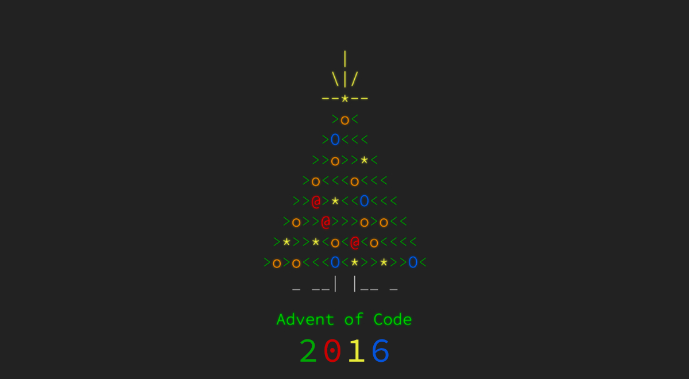

# 🎄 Advent of Code 2016 🎁

| Assignment | Data | Solution R | Solution Python | Solution C++ | Part 1 | Part 2 |
|-------|---|---|---|---|:-:|:-:|
| [Day 1](https://adventofcode.com/2016/day/1) | [Data](data/day1.txt) | [R - D1](solutionsR/day1.R) |   |   | ⭐ | ⭐ |

### Notes
Every day's assignment links to the AOC website. However, just in case, the assignments are backed up in the *assignments* folder. The input data generated by the website is not the same for everyone. The inputs generated for me are stored in the *data* folder.

