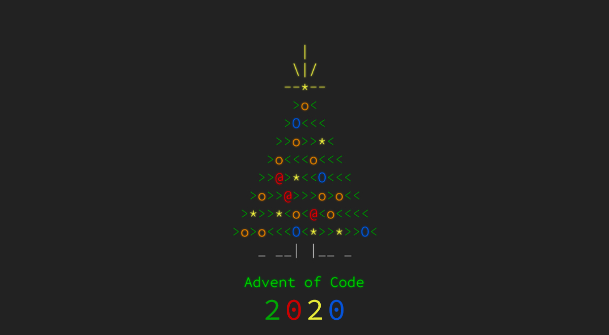

# 🎄 Advent of Code 2020 🎁

| Assignment | Data | Solution R | Solution Python | Solution C++ | Part 1 | Part 2 |
|-------|---|---|---|---|:-:|:-:|
| [Day 1: Report Repair](https://adventofcode.com/2020/day/1) | [Data](data/day1.txt) | [R - D1](solutionsR/day1.R) |   |   | ⭐ | ⭐ |
| [Day 2: Password Philosophy](https://adventofcode.com/2020/day/2) | [Data](data/day2.txt) | [R - D2](solutionsR/day2.R) |   |   | ⭐ | ⭐ |
| [Day 3: Toboggan Trajectory](https://adventofcode.com/2020/day/3) | [Data](data/day3.txt) | [R - D3](solutionsR/day3.R)  |   |   | ⭐ | ⭐ |
| [Day 4](https://adventofcode.com/2020/day/4) |   |   |   |   |   |   |
| [Day 5](https://adventofcode.com/2020/day/5) |   |   |   |   |   |   |
| Day 6 |   |   |   |   |   |   |
| Day 7 |   |   |   |   |   |   |
| Day 8 |   |   |   |   |   |   |
| Day 9 |   |   |   |   |   |   |
| Day 10 |   |   |   |   |   |   |
| Day 11 |   |   |   |   |   |   |
| Day 12 |   |   |   |   |   |   |
| Day 13 |   |   |   |   |   |   |
| Day 14 |   |   |   |   |   |   |
| Day 15 |   |   |   |   |   |   |
| Day 16 |   |   |   |   |   |   |
| Day 17 |   |   |   |   |   |   |
| Day 18 |   |   |   |   |   |   |
| Day 19 |   |   |   |   |   |   |
| Day 20 |   |   |   |   |   |   |
| Day 21 |   |   |   |   |   |   |
| Day 22 |   |   |   |   |   |   |
| Day 23 |   |   |   |   |   |   |
| Day 24 |   |   |   |   |   |   |
| Day 25 |   |   |   |   |   |   |

### Notes
Every day's assignment links to the AOC website. However, just in case, the assignments are backed up in the *assignments* folder. The input data generated by the website is not the same for everyone. The inputs generated for me are stored in the *data* folder.

