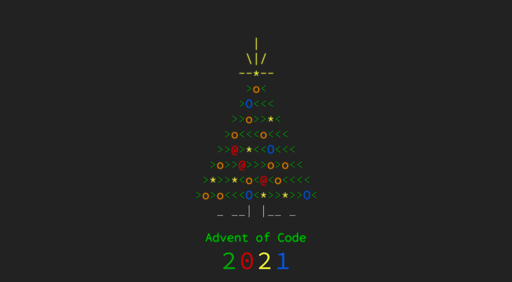

# 🎄 Advent of Code 2021 🎁

| Assignment | Data | Solution R | Solution Python | Part 1 | Part 2 |
|-------|---|---|---|:-:|:-:|
| [Day 1: Sonar Sweep](https://adventofcode.com/2021/day/1) | [Data](data/day1.txt) | [R - D1](solutionsR/day1.R) |   | ⭐ | ⭐ |
| [Day 2: Dive!](https://adventofcode.com/2021/day/2) | [Data](data/day2.txt) | [R - D2](solutionsR/day2.R) |   | ⭐ | ⭐ |
| [Day 3: Binary Diagnostic](https://adventofcode.com/2021/day/3) | [Data](data/day3.txt) | [R - D3](solutionsR/day3.R) |   | ⭐ | ⭐ |
| [Day 4: Giant Squid](https://adventofcode.com/2021/day/4) | [Data](data/day4.txt) | [R - D4](solutionsR/day4.R) |   | ⭐ | ⭐ |
| [Day 5: Hydrothermal Venture](https://adventofcode.com/2021/day/5) | [Data](data/day5.txt) | [R - D5](solutionsR/day5.R) |   | ⭐ | ⭐ |
| [Day 6: Lanternfish](https://adventofcode.com/2021/day/6) | [Data](data/day6.txt) | [R - D6](solutionsR/day6.R) |   | ⭐ | ⭐ |
| [Day 7: The Treachery of Whales](https://adventofcode.com/2021/day/7) | [Data](data/day7.txt) | [R - D7](solutionsR/day7.R) |   | ⭐ | ⭐ |
| [Day 8: Seven Segment Search](https://adventofcode.com/2021/day/8) | [Data](data/day8.txt) | [R - D8](solutionsR/day8.R) |   | ⭐ | ⭐ |
| [Day 9: Smoke Basin](https://adventofcode.com/2021/day/9) | [Data](data/day9.txt) | [R - D9](solutionsR/day9.R) |   | ⭐ | ⭐ |
| [Day 10: Syntax Scoring](https://adventofcode.com/2021/day/10) | [Data](data/day10.txt) | [R - D10](solutionsR/day10.R) |   | ⭐ | ⭐ |
| [Day 11: Dumbo Octopus](https://adventofcode.com/2021/day/11) | [Data](data/day11.txt) | [R - D11](solutionsR/day11.R) |   | ⭐ | ⭐ |
| [Day 12: Passage Pathing](https://adventofcode.com/2021/day/12) | [Data](data/day12.txt) | [R - D12](solutionsR/day12.R) |   | ⭐ | ⭐ |
| [Day 13: Transparent Origami](https://adventofcode.com/2021/day/13) | [Data](data/day13.txt) | [R - D13](solutionsR/day13.R) |   | ⭐ | ⭐ |
| [Day 14: Extended Polymerization](https://adventofcode.com/2021/day/14) | [Data](data/day14.txt) | [R - D14](solutionsR/day14.R) |   | ⭐ | ⭐ |

### Notes

Primarily focusing on R for 2021, other languages coming later.

Every day's assignment links to the AOC website. However, just in case, the assignments are backed up in the *assignments* folder. The input data generated by the website is not the same for everyone. The inputs generated for me are stored in the *data* folder.

